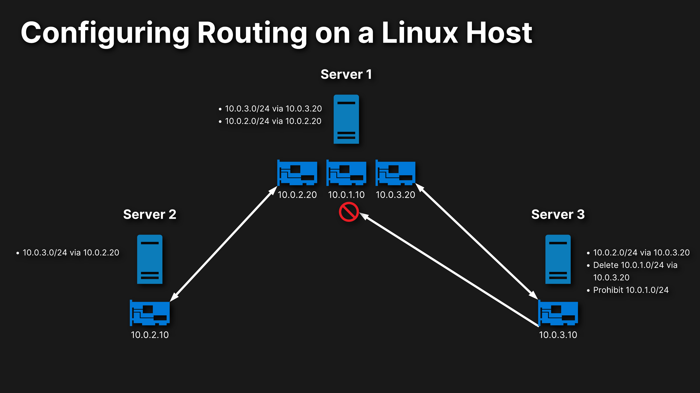

## Configuring routing on a Linux host



### Enable Access from Server 2 and Server 3 to the eth1 and eth2 Interfaces on Server 1

- Find the IP addresses for the eth1 and eth2 interfaces:
  - ```ip a```

- On Server 2, create a static route to enable access for the 10.0.3.0 network on the 10.0.2.20 interface on Server 1:
  - ```ip r add 10.0.3.0/24 via 10.0.2.20 dev eth0```

- On Server 3, create a static route to enable access for the 10.0.2.0 network on the 10.0.2.20 interface on Server 1:
  - ```ip r add 10.0.2.0/24 via 10.0.3.20 dev eth0```

- Verify the routes:
  - ```ip r```

### Enable Access between Server 2 and Server 3

- On Server 1, create a static route for the 10.0.3.0 network on the 10.0.3.20 interface:
  - ```ip r add 10.0.3.0/24 via 10.0.3.20```
- On Server 1, create a static route for the 10.0.2.0 network on the 10.0.2.20 interface:
  - ```ip r add 10.0.2.0/24 via 10.0.2.20```
- Verify the routes:
  - ```ip r```
- On Server 2, ping 10.0.2.20 and 10.0.3.20:
  - ```ping 10.0.2.20```
  - ```ping 10.0.3.20```
- Ping the network interface on Server 3:
  - ```ping 10.0.3.10```
- On Server 3, ping 10.0.2.20:
  - ```ping 10.0.2.20```
- Ping Server 2:
  - ```ping 10.0.2.10```

### Prohibit Access to the 10.0.1.0 Network on Server 3

- Run ip r:
  - ```ip r```
- Ping 10.0.1.10:
  - ```ping 10.0.1.10```
- On Server 3, remove the static route for the 10.0.1.0 network on the 10.0.3.20 interface:
  - ```ip r del 10.0.1.0/24 via 10.0.3.20```
- Verify the route was removed:
  - ```ip r```
- On Server 3, prohibit access to the 10.0.1.0 network:
  - ```ip r add prohibit 10.0.1.0/24```
- Verify traffic is prohibited:
  - ```ip r```
- Try to access 10.0.1.10:
  - ```ping 10.0.1.10```