# Introdução à Infraestrutura de Redes

## Sumário

1. [Fundamentos de Hardware e Computação](#1-fundamentos-de-hardware-e-computação)
   - 1.1 [O que é um Computador?](#11-o-que-é-um-computador)
   - 1.2 [Função do Computador](#12-função-do-computador)
   - 1.3 [Comunicação entre Computadores](#13-comunicação-entre-computadores)

2. [Interfaces e Endereçamento de Rede](#2-interfaces-e-endereçamento-de-rede)
   - 2.1 [Interface de Rede](#21-interface-de-rede)
   - 2.2 [Endereço MAC](#22-endereço-mac)
   - 2.3 [Endereço IP](#23-endereço-ip)
   - 2.4 [Formato de Endereços IP](#24-formato-de-endereços-ip)
   - 2.5 [Máscara, Subrede e Rede](#25-máscara-subrede-e-rede)
   - 2.6 [IPs Públicos e Privados](#26-ips-públicos-e-privados)

3. [Redes Locais e Comunicação](#3-redes-locais-e-comunicação)
   - 3.1 [LAN - Local Area Network](#31-lan---local-area-network)
   - 3.2 [Comunicação Interna na LAN](#32-comunicação-interna-na-lan)
   - 3.3 [Comunicação Externa e Internet](#33-comunicação-externa-e-internet)
   - 3.4 [O que é a Internet?](#34-o-que-é-a-internet)

4. [Serviços e Componentes de Rede](#4-serviços-e-componentes-de-rede)
   - 4.1 [Servidor DNS](#41-servidor-dns)
   - 4.2 [NAT - Network Address Translation](#42-nat---network-address-translation)
   - 4.3 [Roteador](#43-roteador)
   - 4.4 [Provedor de Internet (ISP)](#44-provedor-de-internet-isp)

5. [Configuração e Operação de Rede](#5-configuração-e-operação-de-rede)
   - 5.1 [Atribuição de Endereços IP](#51-atribuição-de-endereços-ip)
   - 5.2 [Múltiplas Interfaces de Rede](#52-múltiplas-interfaces-de-rede)
   - 5.3 [Múltiplos IPs por Interface](#53-múltiplos-ips-por-interface)
   - 5.4 [Relação entre IP e MAC](#54-relação-entre-ip-e-mac)
   - 5.5 [Fluxo de Comunicação na Mesma Rede](#55-fluxo-de-comunicação-na-mesma-rede)
   - 5.6 [Fluxo de Comunicação entre Redes Diferentes](#56-fluxo-de-comunicação-entre-redes-diferentes)

6. [Referências](#6-referências)

7. [Apêndices](#apêndices)
   - A. [Resumo das Analogias](#apêndice-a-resumo-das-analogias)
   - B. [Glossário](#apêndice-b-glossário)
   - C. [Comandos Úteis](#apêndice-c-comandos-úteis)

---

## 1. Fundamentos de Hardware e Computação

### 1.1 O que é um Computador?

Do ponto de vista de **hardware**, um computador é um sistema eletrônico composto por componentes físicos interconectados que trabalham em conjunto para processar dados. Os principais componentes incluem:

- **CPU (Central Processing Unit)**: unidade de processamento central
- **Memória RAM**: armazenamento temporário de dados
- **Armazenamento**: discos rígidos ou SSDs para persistência
- **Placa-mãe**: interconecta todos os componentes
- **Interface de Rede**: permite comunicação com outros dispositivos
- **Dispositivos de Entrada/Saída**: teclado, mouse, monitor, etc.


**Fonte:** Tanenbaum, A. S., & Bos, H. (2014). *Modern Operating Systems* (4th ed.). Pearson.

### 1.2 Função do Computador

A função primordial de um computador é **processar dados** para produzir informações úteis. Este processamento envolve:

1. **Entrada**: Receber dados (input)
2. **Processamento**: Manipular e transformar dados
3. **Armazenamento**: Guardar dados temporária ou permanentemente
4. **Saída**: Apresentar resultados (output)

| Função | Descrição | Exemplo |
|--------|-----------|---------|
| Entrada | Recepção de dados | Digitação no teclado |
| Processamento | Execução de instruções | Cálculos matemáticos |
| Armazenamento | Persistência de dados | Salvar arquivo em disco |
| Saída | Apresentação de resultados | Exibição no monitor |

**Fonte:** Patterson, D. A., & Hennessy, J. L. (2017). *Computer Organization and Design* (5th ed.). Morgan Kaufmann.

### 1.3 Comunicação entre Computadores

Computadores se comunicam através de **sinais elétricos, ópticos ou ondas de rádio** transmitidos por meios físicos ou sem fio. Esta comunicação segue protocolos padronizados que garantem a compreensão mútua dos dados transmitidos.


**Tipos de Meio de Transmissão:**

- **Cabeado**: Cabo ethernet (par trançado), fibra óptica, coaxial
- **Sem Fio**: Wi-Fi, Bluetooth, 4G/5G

**Fonte:** Kurose, J. F., & Ross, K. W. (2021). *Computer Networking: A Top-Down Approach* (8th ed.). Pearson.

---

## 2. Interfaces e Endereçamento de Rede

### 2.1 Interface de Rede

A **interface de rede** (Network Interface) é o componente de hardware e software que permite a um computador conectar-se a uma rede. Ela é responsável por:

- Converter dados digitais em sinais transmissíveis
- Receber e decodificar sinais da rede
- Controlar o acesso ao meio de transmissão
- Identificar o dispositivo na rede através do endereço MAC

**Tipos Comuns:**

| Tipo | Descrição | Exemplo |
|------|-----------|---------|
| NIC (Network Interface Card) | Placa de rede física | Ethernet 1Gbps |
| Interface Wireless | Adaptador Wi-Fi | Wi-Fi 802.11ac |
| Interface Virtual | Criada por software | Interface de loopback (127.0.0.1) |

**Fonte:** Stallings, W. (2013). *Data and Computer Communications* (10th ed.). Pearson.

### 2.2 Endereço MAC

O **endereço MAC** (Media Access Control) é um identificador único e permanente atribuído à interface de rede pelo fabricante. Características:

- **Formato**: 48 bits (6 bytes) em hexadecimal
- **Exemplo**: `00:1A:2B:3C:4D:5E`
- **Escopo**: Camada 2 do modelo OSI (Enlace)
- **Unicidade**: Teoricamente único no mundo

#### Analogia: MAC como CPF

Pense no **endereço MAC como um CPF**:
- **Único e permanente**: Assim como cada pessoa tem um CPF único que não muda ao longo da vida, cada interface de rede tem um MAC único atribuído pelo fabricante
- **Identificação física**: O CPF identifica a pessoa fisicamente; o MAC identifica a placa de rede fisicamente
- **Não muda com a localização**: Se você muda de cidade, seu CPF continua o mesmo; se a placa de rede muda de rede, o MAC permanece inalterado


**Fonte:** IEEE Standards Association. (2020). *IEEE 802 Standards*.

### 2.3 Endereço IP

O **endereço IP** (Internet Protocol) é um identificador lógico atribuído a dispositivos em uma rede que utiliza o protocolo IP. Diferente do MAC:

- É **configurável** e pode mudar
- Opera na **Camada 3** do modelo OSI (Rede)
- Permite **roteamento** entre redes diferentes
- Possui hierarquia (rede + host)

#### Analogia: IP como Endereço Residencial

Pense no **endereço IP como um endereço residencial completo**:
- **Mutável**: Assim como você pode mudar de casa (e ter um novo endereço), um dispositivo pode receber diferentes IPs
- **Hierárquico**: Um endereço tem estrutura: Rua → Número → Cidade → Estado. Um IP tem: Rede → Host
- **Roteável**: Os Correios usam o endereço para entregar cartas através de diferentes centros de distribuição; roteadores usam IPs para entregar pacotes através de diferentes redes

**Versões:**

- **IPv4**: 32 bits, aproximadamente 4.3 bilhões de endereços
- **IPv6**: 128 bits, aproximadamente 340 undecilhões de endereços

**Fonte:** Comer, D. E. (2018). *Internetworking with TCP/IP* (6th ed.). Pearson.

### 2.4 Formato de Endereços IP

#### IPv4 (Internet Protocol version 4)

- **Formato**: 4 octetos separados por pontos
- **Notação decimal**: `192.168.1.1`
- **Notação binária**: `11000000.10101000.00000001.00000001`
- **Faixa**: 0.0.0.0 até 255.255.255.255


#### IPv6 (Internet Protocol version 6)

- **Formato**: 8 grupos de 4 dígitos hexadecimais separados por dois pontos
- **Exemplo**: `2001:0db8:85a3:0000:0000:8a2e:0370:7334`
- **Forma abreviada**: `2001:db8:85a3::8a2e:370:7334`

| Versão | Tamanho | Exemplo | Quantidade de Endereços |
|--------|---------|---------|-------------------------|
| IPv4 | 32 bits | 192.168.1.1 | ~4.3 bilhões |
| IPv6 | 128 bits | 2001:db8::1 | ~340 undecilhões |

**Fonte:** Hagen, S. (2014). *IPv6 Essentials* (3rd ed.). O'Reilly Media.

### 2.5 Máscara, Subrede e Rede

#### Máscara de Subrede

A **máscara de subrede** (subnet mask) define quais bits do endereço IP representam a **rede** e quais representam o **host**.

- **Formato**: Similar ao IPv4 (4 octetos)
- **Exemplo**: `255.255.255.0` ou `/24` (notação CIDR)

#### Analogia: Rede como Sistema Postal

Pense na estrutura de endereçamento como o sistema de endereços postal brasileiro:
- **IP de Rede** = **CEP** (identifica o bairro/região inteira, ex: 01310-100)
- **IP do Host** = **Número da casa** (identifica um local específico dentro do CEP, ex: Av. Paulista, 1578)
- **Subrede** = **Rua específica dentro de um bairro** (uma divisão menor dentro do CEP)
- **Máscara de Subrede** = Define onde termina o "CEP" e começa o "número da casa"

Exemplo: 192.168.1.100/24
- `192.168.1` → CEP/Bairro (identifica a rede)
- `.100` → Número da casa (identifica o computador específico)


#### Conceitos Relacionados

| Conceito | Descrição | Exemplo |
|----------|-----------|---------|
| **Rede** | Conjunto de dispositivos que compartilham o mesmo prefixo de rede | 192.168.1.0/24 |
| **Subrede** | Divisão de uma rede maior em redes menores | Dividir 192.168.0.0/16 em múltiplas /24 |
| **Endereço de Rede** | Primeiro endereço da faixa (host = 0) | 192.168.1.0 |
| **Broadcast** | Último endereço da faixa (todos hosts = 1) | 192.168.1.255 |
| **Hosts utilizáveis** | Endereços entre rede e broadcast | 192.168.1.1 - 192.168.1.254 |

#### Cálculo de Subrede

Para a rede `192.168.1.0/24`:

```
Endereço de Rede:    192.168.1.0
Máscara:             255.255.255.0 (/24)
Primeiro Host:       192.168.1.1
Último Host:         192.168.1.254
Broadcast:           192.168.1.255
Total de Hosts:      254 endereços utilizáveis
```

**Fonte:** Odom, W. (2019). *CCNA 200-301 Official Cert Guide Library*. Cisco Press.

### 2.6 IPs Públicos e Privados

#### Endereços IP Privados

São reservados para uso em redes internas e **não são roteáveis** na Internet. Definidos pela RFC 1918:

| Classe | Faixa de Endereços | Máscara Padrão | Notação CIDR |
|--------|-------------------|----------------|--------------|
| A | 10.0.0.0 - 10.255.255.255 | 255.0.0.0 | 10.0.0.0/8 |
| B | 172.16.0.0 - 172.31.255.255 | 255.240.0.0 | 172.16.0.0/12 |
| C | 192.168.0.0 - 192.168.255.255 | 255.255.0.0 | 192.168.0.0/16 |

#### Endereços IP Públicos

São únicos globalmente e **roteáveis** na Internet. Atribuídos por organizações como IANA, ARIN, RIPE, etc.

#### Analogia: IPs Públicos vs Privados

**IP Privado** = **Ramal telefônico interno de empresa**
- Funciona **apenas dentro da empresa** (192.168.x.x, 10.x.x.x)
- **Ramal 100, 101, 102...** (não são únicos no mundo, várias empresas usam)
- **Não pode receber ligações diretas** de fora
- **Precisa da recepcionista** (NAT) para falar com o mundo externo

**IP Público** = **Número de telefone fixo/celular**
- **Único no mundo todo** (como 8.8.8.8 do Google)
- **Qualquer pessoa pode ligar** diretamente
- **Roteável globalmente** (funciona em qualquer lugar)
- **Limitado/caro** (por isso empresas usam 1 IP público com NAT para vários IPs privados)

**Exemplos:**

- **IP Privado**: `192.168.1.100`, `10.0.0.50`, `172.16.5.1`
- **IP Público**: `8.8.8.8` (Google DNS), `1.1.1.1` (Cloudflare DNS)

**Fonte:** IETF RFC 1918. (1996). *Address Allocation for Private Internets*.

---

## 3. Redes Locais e Comunicação

### 3.1 LAN - Local Area Network

Uma **LAN** (Local Area Network) é uma rede de computadores limitada a uma área geográfica pequena, como:

- Residência
- Escritório
- Prédio
- Campus universitário

#### Analogia: LAN como Condomínio

Pense em uma **LAN como um condomínio fechado**:
- **Todos dentro do condomínio** podem conversar diretamente entre si (mesma rede local)
- **Comunicação interna é rápida** (não precisa sair do condomínio)
- **Para falar com alguém fora**, precisa passar pela portaria/entrada (roteador/gateway)
- **Todos compartilham a mesma infraestrutura** (cabos, switches, Wi-Fi)
- **Endereços internos** funcionam apenas dentro do condomínio (IPs privados)

**Características:**

| Característica | Descrição |
|---------------|-----------|
| Alcance | Até alguns quilômetros |
| Velocidade | Alta (100 Mbps - 10 Gbps+) |
| Propriedade | Privada (uma organização) |
| Topologia | Estrela, barramento, anel |
| Tecnologia comum | Ethernet, Wi-Fi |


**Fonte:** Stallings, W. (2013). *Data and Computer Communications* (10th ed.). Pearson.

### 3.2 Comunicação Interna na LAN

A comunicação dentro de uma LAN ocorre principalmente na **Camada 2** (Enlace) usando endereços MAC:

#### Processo de Comunicação

1. **Computador A** quer enviar dados para **Computador B**
2. A verifica se B está na mesma rede (compara IPs com máscara)
3. A usa **ARP** (Address Resolution Protocol) para descobrir o MAC de B
4. A envia quadro Ethernet diretamente para o MAC de B
5. Switch encaminha o quadro apenas para a porta onde B está conectado

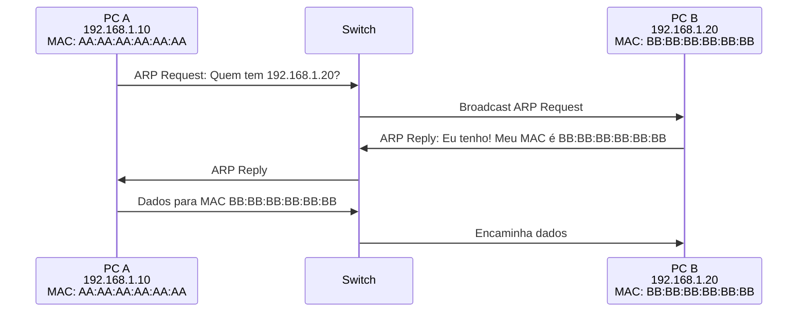

**Componentes Envolvidos:**

- **Switch**: Dispositivo de Camada 2 que aprende MACs e encaminha quadros
- **Protocolo ARP**: Resolve endereços IP em endereços MAC
- **Quadros Ethernet**: Unidade de dados da Camada 2

#### Analogia: Switch como Porteiro Eficiente

Pense no **switch como um porteiro inteligente de condomínio**:
- **Conhece todos os moradores** (aprende os endereços MAC)
- **Sabe em qual apartamento cada um mora** (tabela MAC)
- **Entrega correspondências diretamente** no apartamento certo (não entrega para todos)
- **Na dúvida, pergunta para todos** (broadcast quando não conhece o MAC)
- **Quanto mais tempo trabalha**, mais eficiente fica (aprende novos MACs)

**Fonte:** Kurose, J. F., & Ross, K. W. (2021). *Computer Networking: A Top-Down Approach* (8th ed.). Pearson.

### 3.3 Comunicação Externa e Internet

Para comunicar **fora da LAN**, é necessário um **roteador** (gateway) que:

1. Conecta a LAN a outras redes
2. Realiza **roteamento** entre redes diferentes
3. Geralmente realiza **NAT** (tradução de endereços)
4. Encaminha pacotes baseado em endereços IP

#### Analogia: Gateway/Roteador como Portaria do Condomínio

Pense no **gateway (roteador) como a portaria do condomínio**:
- **Única saída/entrada oficial** para o mundo externo
- **Conhece todos os moradores** (dispositivos da LAN)
- **Anota quem saiu e para onde** (tabela NAT)
- **Quando alguém retorna**, sabe para qual apartamento encaminhar
- **Bloqueia intrusos** (firewall)
- **Traduz endereços internos** (IP privado) para externos (IP público)

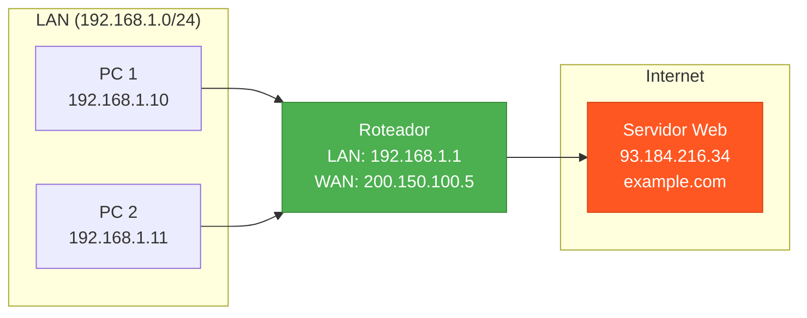

**Processo:**

1. PC identifica que destino está **fora** da LAN
2. PC envia pacote para o **gateway padrão** (roteador)
3. Roteador consulta **tabela de roteamento**
4. Roteador encaminha pacote para próximo salto
5. Pacote atravessa múltiplos roteadores até o destino

**Fonte:** Forouzan, B. A. (2017). *TCP/IP Protocol Suite* (4th ed.). McGraw-Hill.

### 3.4 O que é a Internet?

A **Internet** é uma rede global de computadores interconectados que utilizam protocolos padronizados (TCP/IP) para comunicação. Pode ser definida de duas perspectivas:

#### Perspectiva de Hardware

- **Bilhões de dispositivos** conectados (hosts/end systems)
- **Enlaces de comunicação**: fibra óptica, satélite, rádio, cabo
- **Roteadores e switches** interconectando redes
- **Infraestrutura global** de cabos submarinos e terrestres

#### Perspectiva de Serviços

- **Infraestrutura** que fornece serviços a aplicações
- **APIs de programação** para desenvolvedores (sockets)
- **Protocolos padronizados** (HTTP, SMTP, FTP, etc.)

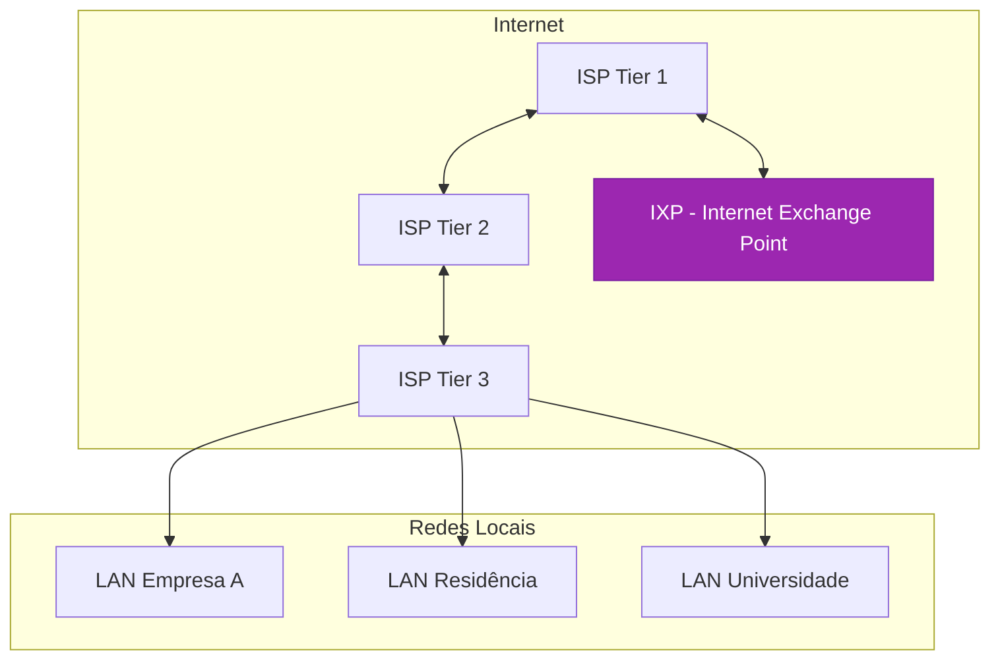

**Características:**

- **Descentralizada**: Sem controle central
- **Escalável**: Suporta crescimento contínuo
- **Resiliente**: Múltiplos caminhos redundantes
- **Aberta**: Baseada em padrões públicos

**Fonte:** Leiner, B. M., et al. (2009). *A Brief History of the Internet*. ACM SIGCOMM Computer Communication Review.

---

## 4. Serviços e Componentes de Rede

### 4.1 Servidor DNS

O **DNS** (Domain Name System) é um sistema distribuído que traduz nomes de domínio legíveis por humanos em endereços IP.

#### Função

Resolver nomes como `www.google.com` em endereços IP como `142.250.190.46`.

#### Analogia: DNS como Agenda Telefônica

Pense no **DNS como uma agenda telefônica gigante da Internet**:
- **Nome de contato** = Nome do site (www.google.com)
- **Número de telefone** = Endereço IP (142.250.190.46)
- **É mais fácil lembrar** "Google" do que "142.250.190.46"
- **Se o número mudar**, você atualiza a agenda, mas o nome continua o mesmo

#### Por que é Necessário?

- Humanos preferem nomes (mais fáceis de lembrar)
- Computadores precisam de IPs para rotear pacotes
- IPs podem mudar; nomes permanecem estáveis

#### Hierarquia DNS

```
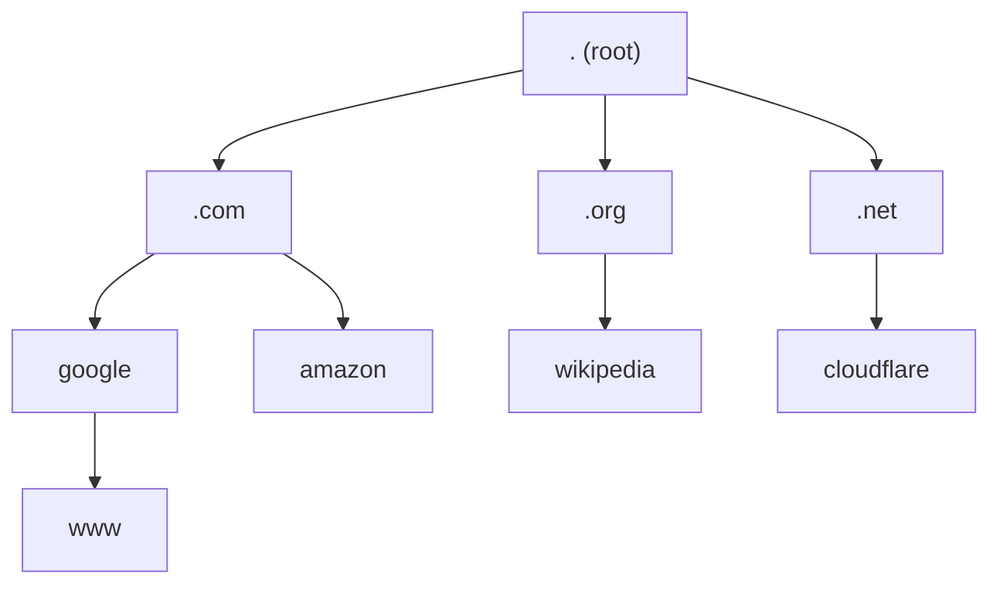
```

#### Processo de Resolução DNS

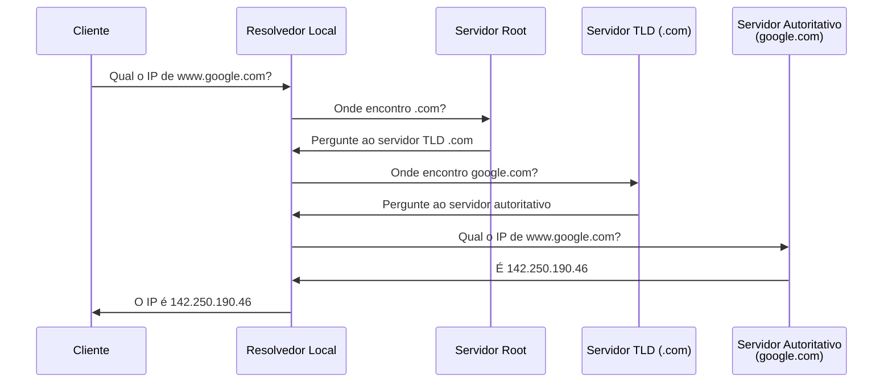

#### Tipos de Registros DNS

| Tipo | Descrição | Exemplo |
|------|-----------|---------|
| A | Mapeia nome para IPv4 | example.com → 93.184.216.34 |
| AAAA | Mapeia nome para IPv6 | example.com → 2606:2800:220:1:248:1893:25c8:1946 |
| CNAME | Alias para outro nome | www.example.com → example.com |
| MX | Servidor de email | example.com → mail.example.com |
| NS | Servidor de nomes autoritativo | example.com → ns1.dns.com |
| TXT | Texto arbitrário | SPF, DKIM para validação |

**Fonte:** Mockapetris, P. (1987). *RFC 1034 & 1035 - Domain Names - Implementation and Specification*. IETF.

### 4.2 NAT - Network Address Translation

**NAT** (Network Address Translation) é uma técnica que permite múltiplos dispositivos em uma rede privada compartilharem um único endereço IP público/privado (capaz de accesar a rede alvo).

#### Analogia: NAT como Recepcionista de Empresa

Pense no **NAT como a recepcionista/telefonista de uma empresa**:
- **A empresa tem 1 número principal** (IP público) para o mundo externo
- **Internamente, há muitos ramais** (IPs privados: 192.168.x.x)
- **Ligações externas**: Todos ligam para o número principal, a recepcionista direciona para o ramal correto
- **Ligações internas para fora**: A recepcionista anota quem ligou (tabela NAT) e quando a resposta volta, ela sabe para qual ramal encaminhar
- **Segurança**: Pessoas de fora não conhecem os ramais internos, só o número principal

#### Função e Benefícios

| Benefício | Descrição |
|-----------|-----------|
| **Economia de IPs** | Múltiplos dispositivos usam um IP público |
| **Segurança** | Oculta estrutura interna da rede |
| **Flexibilidade** | Permite reorganização interna sem afetar exterior |

#### Como Funciona

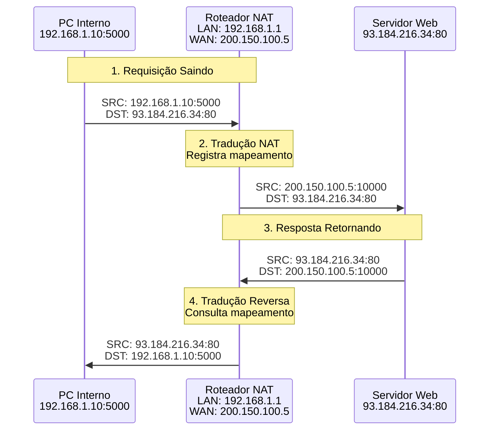

#### Tabela de Tradução NAT

| IP Privado:Porta | IP Público:Porta | Estado |
|------------------|------------------|--------|
| 192.168.1.10:5000 | 200.150.100.5:10000 | ESTABELECIDA |
| 192.168.1.11:5001 | 200.150.100.5:10001 | ESTABELECIDA |
| 192.168.1.10:5002 | 200.150.100.5:10002 | ESTABELECIDA |

#### Tipos de NAT

1. **NAT Estático**: Mapeamento 1:1 permanente
2. **NAT Dinâmico**: Mapeamento de pool de IPs públicos
3. **PAT (Port Address Translation)**: Também chamado NAT Overload - usa portas diferentes

**Limitações:**

- Dificulta conexões iniciadas de fora (servidores internos)
- Quebra princípio end-to-end da Internet
- Pode causar problemas com alguns protocolos (FTP, SIP)

**Fonte:** Srisuresh, P., & Egevang, K. (2001). *RFC 3022 - Traditional IP Network Address Translator*. IETF.

### 4.3 Roteador

Um **roteador** é um dispositivo de rede que opera na **Camada 3** (Rede) e é responsável por encaminhar pacotes entre diferentes redes.

#### Analogia: Roteador como Centro de Distribuição dos Correios

Pense no **roteador como um centro de distribuição dos Correios**:
- **Recebe correspondências de diversos bairros** (diferentes redes)
- **Lê o CEP do destino** (endereço IP)
- **Consulta mapas e rotas** (tabela de roteamento)
- **Decide para qual centro enviar** (próximo salto)
- **Conecta bairros diferentes** (interconecta redes)
- **Cada centro só conhece** os centros vizinhos, não o caminho completo (roteamento distribuído)

#### Funções Principais

1. **Roteamento**: Determinar o melhor caminho para destino
2. **Encaminhamento**: Mover pacotes de entrada para saída apropriada
3. **Interconexão**: Conectar redes diferentes
4. **Tradução**: NAT, conversão de protocolos

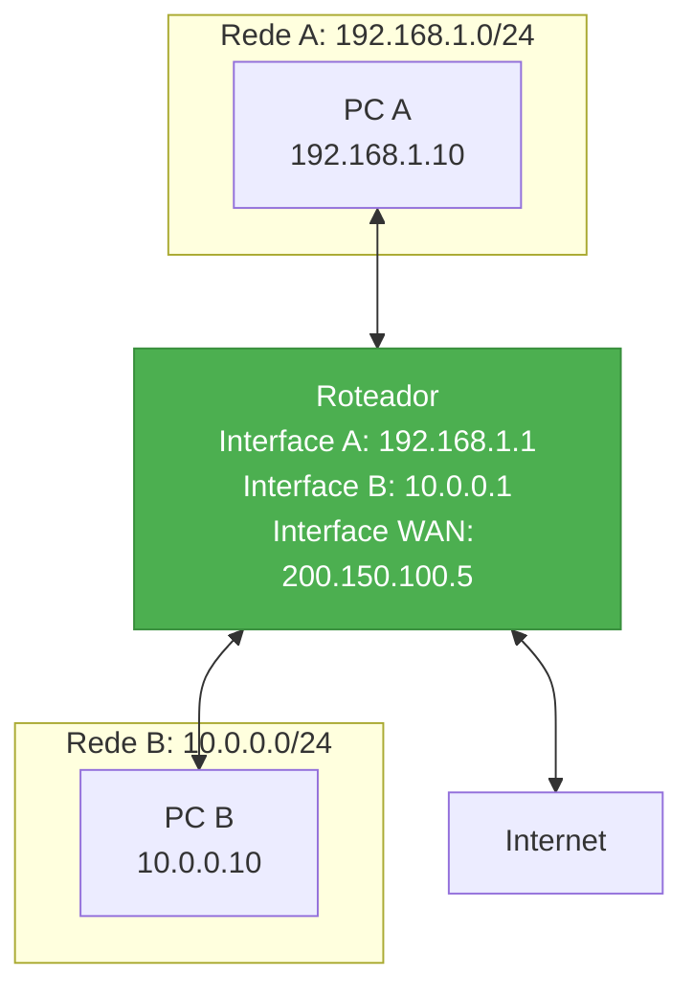

#### Tabela de Roteamento

Exemplo de tabela de roteamento:

| Rede Destino | Máscara | Gateway | Interface | Métrica |
|--------------|---------|---------|-----------|---------|
| 0.0.0.0 | 0.0.0.0 | 200.150.100.1 | WAN | 1 |
| 192.168.1.0 | 255.255.255.0 | 0.0.0.0 | eth0 | 0 |
| 10.0.0.0 | 255.255.255.0 | 0.0.0.0 | eth1 | 0 |

#### Diferença: Roteador vs Switch

| Característica | Switch | Roteador |
|---------------|--------|----------|
| Camada OSI | 2 (Enlace) | 3 (Rede) |
| Endereçamento | MAC | IP |
| Função | Conectar dispositivos na mesma rede | Conectar redes diferentes |
| Decisão | Tabela MAC | Tabela de roteamento |
| Broadcast | Propaga | Bloqueia |

#### Analogia: Switch vs Roteador

**Switch** = **Porteiro do condomínio**
- Trabalha **dentro do condomínio** (mesma rede local)
- Conhece todos os **apartamentos** (endereços MAC)
- Entrega correspondência **entre moradores**

**Roteador** = **Portaria/Entrada do condomínio**
- Conecta o **condomínio com a rua** (interconecta redes)
- Lê **endereços externos** (IPs de outras redes)
- Decide **para onde enviar** correspondências externas

**Fonte:** Cisco Systems. (2020). *Cisco Networking Academy Curriculum*.

### 4.4 Provedor de Internet (ISP)

Um **ISP** (Internet Service Provider) é uma organização que fornece acesso à Internet para clientes residenciais e empresariais.

#### Analogia: ISP como Companhia de Energia/Água

Pense no **ISP como a companhia de energia elétrica ou água**:
- **Fornece acesso** à infraestrutura (assim como luz/água chegam em sua casa)
- **Você paga mensalmente** pelo serviço
- **Podem ter problemas**: quedas de conexão (como falta de luz)
- **Fornece o "endereço público"** (IP público) que te identifica na Internet

#### Papel do ISP

1. **Conectividade**: Fornece conexão física à Internet
2. **Endereçamento**: Atribui endereços IP públicos
3. **Roteamento**: Roteia tráfego entre cliente e Internet
4. **Serviços**: DNS, email, hospedagem, etc.

#### Hierarquia de ISPs


#### Classificação

| Tier | Descrição | Características |
|------|-----------|-----------------|
| **Tier 1** | Backbone global | Não pagam trânsito; peering com outros Tier 1 |
| **Tier 2** | ISPs regionais | Compram trânsito de Tier 1; vendem para Tier 3 |
| **Tier 3** | ISPs locais | Compram de Tier 2; atendem usuários finais |

#### Analogia: Hierarquia de ISPs como Sistema de Distribuição

**Tier 1** = **Grandes fabricantes/usinas** (AT&T, Level 3)
- Produzem e distribuem em **escala global**
- **Fazem acordos entre si** (peering) - "eu deixo seu tráfego passar, você deixa o meu"
- **Infraestrutura própria** massiva (cabos submarinos)

**Tier 2** = **Distribuidoras regionais** (empresas estaduais)
- **Compram** atacado do Tier 1
- **Revendem** para distribuidoras locais
- Cobrem estados/regiões

**Tier 3** = **Lojas locais/varejistas** (seu provedor de bairro)
- **Compram** de Tier 2
- **Vendem** diretamente para você (consumidor final)
- Atendem sua casa/empresa

**Exemplos de ISPs Tier 1:**
- AT&T
- Level 3 Communications
- NTT Communications
- Telia Carrier

**Fonte:** Norton, W. B. (2011). *The Internet Peering Playbook*. DrPeering Press.

---

## 5. Configuração e Operação de Rede

### 5.1 Atribuição de Endereços IP

Existem duas formas principais de um dispositivo receber um endereço IP:

#### 1. Configuração Manual (IP Estático)

O administrador configura manualmente:
- Endereço IP
- Máscara de subrede
- Gateway padrão
- Servidores DNS

**Uso comum**: Servidores, impressoras de rede, equipamentos de infraestrutura

#### 2. Configuração Automática (DHCP)

O **DHCP** (Dynamic Host Configuration Protocol) atribui automaticamente configurações de rede.

#### Analogia: DHCP como Recepção de Hotel

Pense no **DHCP como a recepção de um hotel**:
- **Cliente chega** (dispositivo conecta na rede)
- **Pede um quarto** (solicita configurações de rede)
- **Recepção verifica disponibilidade** (servidor DHCP consulta pool de IPs)
- **Atribui um quarto temporário** (empresta um IP por tempo determinado - lease)
- **Fornece informações**: número do quarto (IP), localização do elevador (gateway), telefone da recepção (DNS)
- **Quando o hóspede sai**, o quarto fica disponível para outros (IP retorna ao pool)
- **Pode renovar a estadia** (renovação de lease)

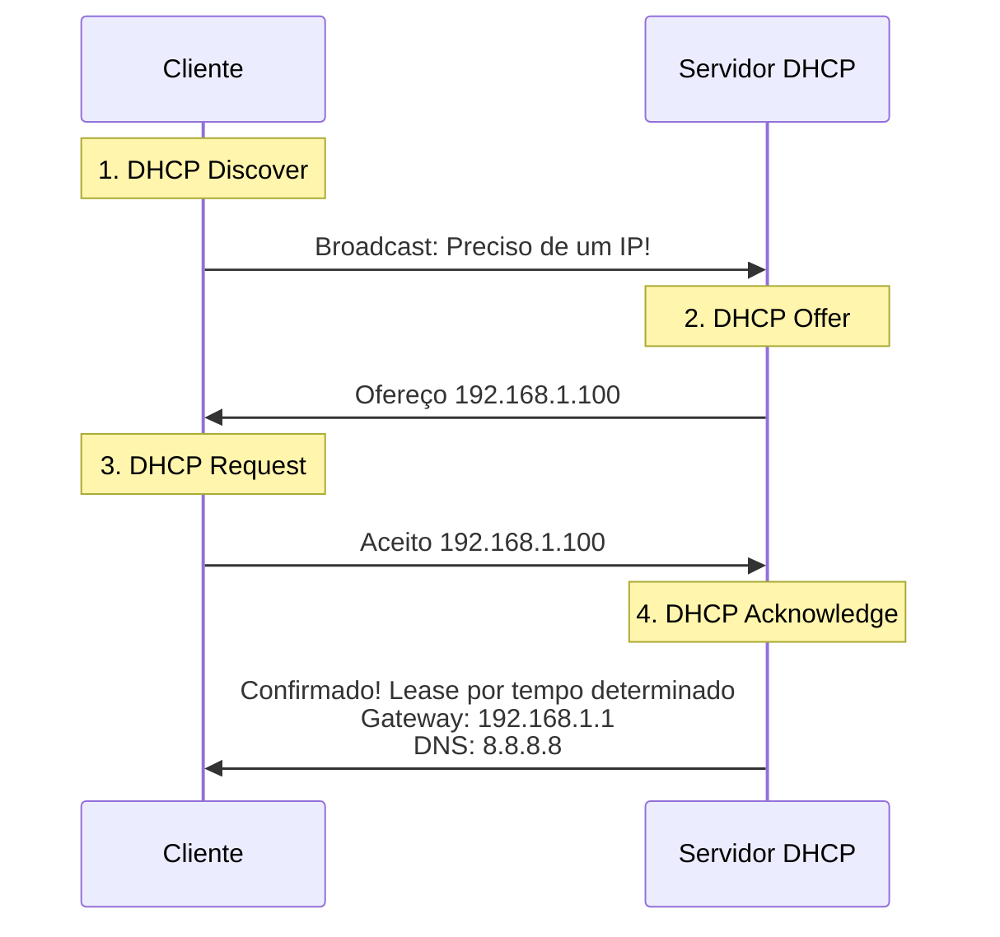

#### Processo DHCP (DORA)

| Etapa | Nome | Descrição |
|-------|------|-----------|
| 1 | **D**iscover | Cliente busca servidor DHCP (broadcast) |
| 2 | **O**ffer | Servidor oferece configuração |
| 3 | **R**equest | Cliente aceita oferta |
| 4 | **A**cknowledge | Servidor confirma atribuição |

#### Informações Fornecidas pelo DHCP

- Endereço IP
- Máscara de subrede
- Gateway padrão
- Servidores DNS
- Tempo de lease (duração da atribuição)
- Outros parâmetros (servidor NTP, domínio, etc.)

**Fonte:** Droms, R. (1997). *RFC 2131 - Dynamic Host Configuration Protocol*. IETF.

### 5.2 Múltiplas Interfaces de Rede

**Sim**, é possível e comum ter múltiplas interfaces de rede em um único computador.

#### Cenários Comuns

| Cenário | Descrição | Exemplo |
|---------|-----------|---------|
| Ethernet + Wi-Fi | Conexão cabeada e sem fio | Laptop moderno |
| Múltiplas Ethernets | Servidor com várias NICs | Servidor web com separação front/back |
| Interfaces virtuais | VPNs, VLANs, containers | Máquina virtual com múltiplas redes |
| Roteador/Firewall | Conecta diferentes redes | Roteador com WAN + LAN |

#### Roteamento com Múltiplas Interfaces

O sistema operacional usa uma **tabela de roteamento** para decidir qual interface usar:

| Destino        | Gateway       | Interface        |
|----------------|--------------|------------------------|
| 0.0.0.0        | 192.168.1.1  | eth0 (rota padrão)     |
| 192.168.1.0/24 | 0.0.0.0      | eth0 (rede local)      |
| 10.0.0.0/24    | 0.0.0.0      | wlan0 (rede local)     |
| 127.0.0.0/8    | 0.0.0.0      | lo (loopback)          |

**Fonte:** Stevens, W. R. (1994). *TCP/IP Illustrated, Volume 1*. Addison-Wesley.

### 5.3 Múltiplos IPs por Interface

**Sim**, uma interface de rede pode ter múltiplos endereços IP atribuídos (IP aliasing).

#### Casos de Uso

1. **Hospedagem Virtual**: Servidor web hospeda múltiplos sites
2. **Migração**: Transição gradual entre faixas de IP
3. **Múltiplas Redes**: Interface pertence a várias subredes
4. **Alta Disponibilidade**: IPs virtuais para failover

**Fonte:** Cisco Systems. (2020). *Cisco IOS IP Configuration Guide*.

### 5.4 Relação entre IP e MAC

IP e MAC são endereços complementares que operam em camadas diferentes do modelo OSI:

#### Diferenças Fundamentais

| Característica | Endereço MAC | Endereço IP |
|---------------|--------------|-------------|
| **Camada OSI** | 2 (Enlace) | 3 (Rede) |
| **Tamanho** | 48 bits (6 bytes) | 32 bits (IPv4) ou 128 bits (IPv6) |
| **Formato** | Hexadecimal (AA:BB:CC:DD:EE:FF) | Decimal (192.168.1.1) |
| **Atribuição** | Fabricante (permanente) | Configuração (dinâmica) |
| **Escopo** | Local (segmento de rede) | Global (roteável) |
| **Função** | Identificação física | Endereçamento lógico |

#### Relação e Cooperação

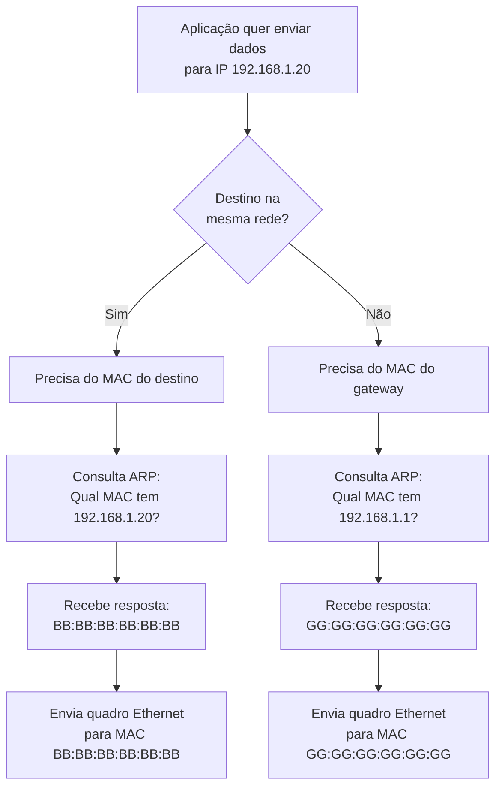

#### Protocolo ARP

O **ARP** (Address Resolution Protocol) resolve IPs em MACs:

#### Analogia: ARP como Perguntar em Voz Alta no Condomínio

Pense no **ARP como gritar no pátio do condomínio**:
- Você sabe que **João mora no condomínio** (conhece o IP da rede)
- Mas **não sabe qual apartamento** é o dele (não conhece o MAC)
- Você **grita no pátio**: "João, qual é o seu apartamento?" (ARP Request em broadcast)
- **Todos ouvem**, mas só João responde: "Eu sou o apartamento 301!" (ARP Reply com MAC)
- Você **anota na sua agenda** para não precisar perguntar novamente (cache ARP)
- **Depois de um tempo** você esquece (entrada expira do cache) e precisa perguntar de novo

```
Pergunta ARP:  "Quem tem o IP 192.168.1.20? Diga ao MAC AA:AA:AA:AA:AA:AA"
Resposta ARP:  "Eu tenho 192.168.1.20! Meu MAC é BB:BB:BB:BB:BB:BB"
```

#### Cache ARP

Sistemas mantêm uma **tabela ARP** em cache:

| Endereço IP | Endereço MAC | Interface | Tempo |
|-------------|--------------|-----------|-------|
| 192.168.1.1 | 00:11:22:33:44:55 | eth0 | 120s |
| 192.168.1.20 | AA:BB:CC:DD:EE:FF | eth0 | 95s |
| 192.168.1.30 | FF:EE:DD:CC:BB:AA | eth0 | 200s |

**Visualizar cache ARP:**

```bash
# Linux/macOS
arp -a

# Windows
arp -a
```

**Fonte:** Plummer, D. C. (1982). *RFC 826 - An Ethernet Address Resolution Protocol*. IETF.

### 5.5 Fluxo de Comunicação na Mesma Rede

Quando dois computadores estão na **mesma rede local**, a comunicação é direta via switch.

#### Cenário

- **Computador A**: 192.168.1.10 (MAC: AA:AA:AA:AA:AA:AA)
- **Computador B**: 192.168.1.20 (MAC: BB:BB:BB:BB:BB:BB)
- **Rede**: 192.168.1.0/24

#### Fluxo Passo a Passo

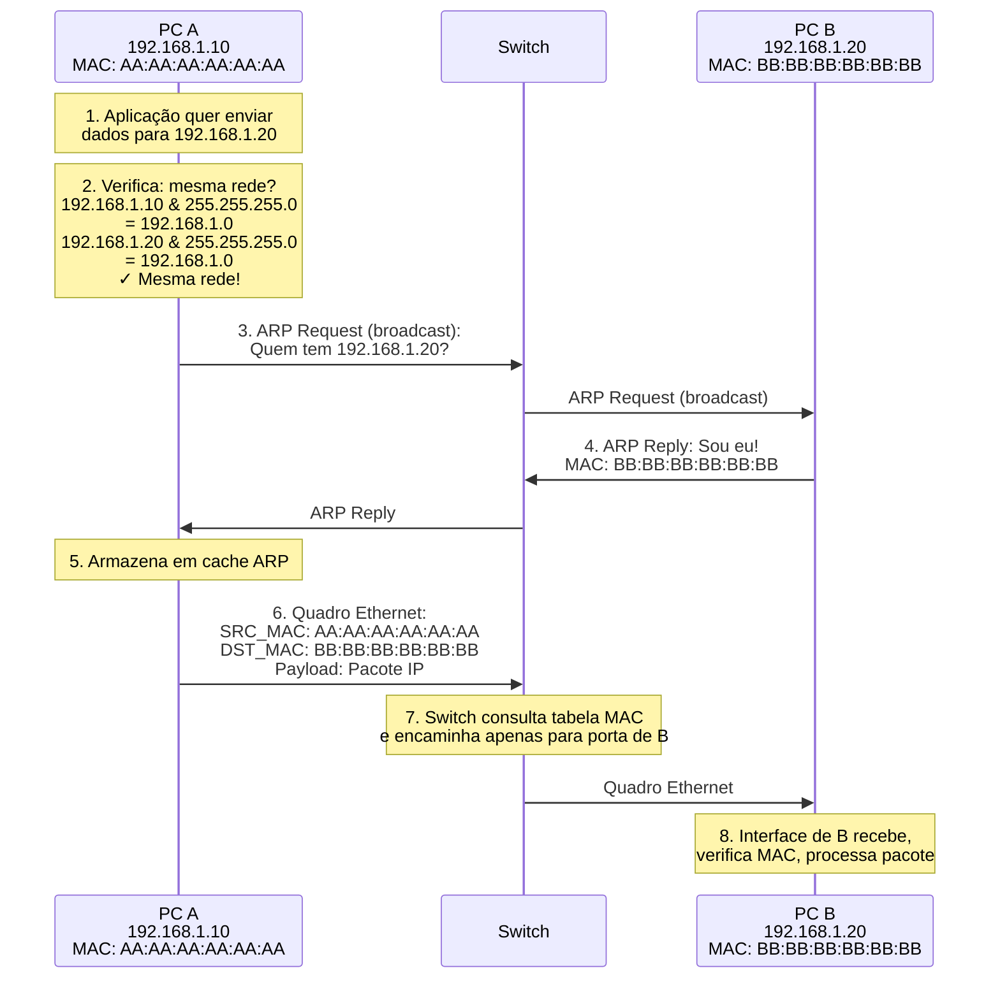

#### Camadas Envolvidas

| Camada | Componente | Função |
|--------|------------|--------|
| 7-4 (Aplicação-Transporte) | Dados + cabeçalhos | Preparação de dados |
| 3 (Rede) | Pacote IP | SRC_IP: 192.168.1.10, DST_IP: 192.168.1.20 |
| 2 (Enlace) | Quadro Ethernet | SRC_MAC: AA:AA..., DST_MAC: BB:BB... |
| 1 (Física) | Sinais elétricos | Transmissão pelo cabo |

**Fonte:** Tanenbaum, A. S., & Wetherall, D. (2010). *Computer Networks* (5th ed.). Pearson.

### 5.6 Fluxo de Comunicação entre Redes Diferentes

Quando os computadores estão em **redes diferentes**, é necessário **roteamento**.

#### Cenário

- **Computador A**: 192.168.1.10/24 (MAC: AA:AA:AA:AA:AA:AA)
- **Roteador**: 
  - Interface LAN: 192.168.1.1 (MAC: RR:RR:RR:RR:RR:RR)
  - Interface WAN: 200.150.100.5
- **Servidor Web**: 93.184.216.34 (na Internet)

#### Fluxo Detalhado

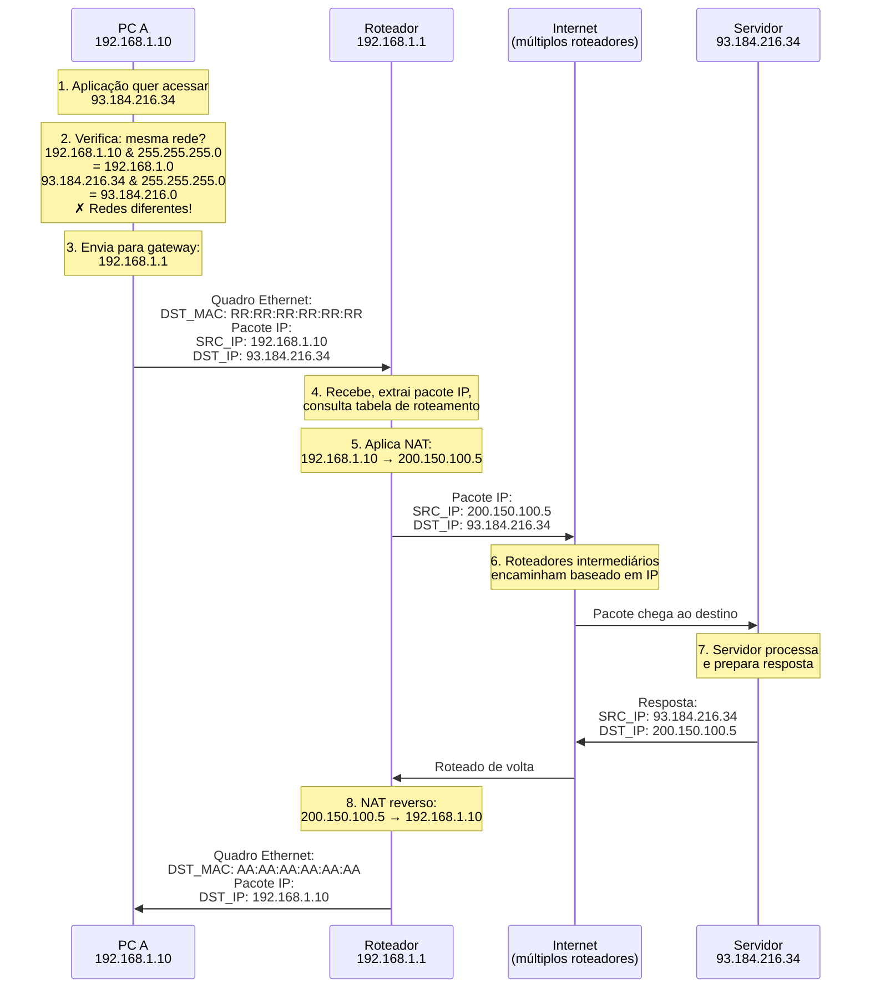

#### Detalhes por Etapa

**No Computador A:**
1. Identifica que destino está em rede diferente
2. Consulta tabela de roteamento → gateway padrão
3. Resolve MAC do gateway via ARP
4. Envia quadro para MAC do roteador com pacote IP intacto

**No Roteador:**
1. Recebe quadro, extrai pacote IP
2. Consulta tabela de roteamento
3. Aplica NAT (traduz IP privado → público)
4. Encapsula em novo quadro Ethernet
5. Envia para próximo salto

**Na Internet:**
- Cada roteador repete: recebe, consulta tabela, encaminha
- Decisões baseadas apenas em IP de destino
- MACs mudam a cada salto; IP permanece

**No Destino:**
- Recebe pacote
- Processa e responde
- Resposta segue caminho inverso (possivelmente diferente)

#### TTL (Time to Live)

Cada pacote IP tem um contador **TTL** que:
- Inicia com valor alto (ex: 64, 128, 255)
- É decrementado em cada roteador
- Se chegar a 0, pacote é descartado (previne loops infinitos)

**Fonte:** Comer, D. E. (2018). *Internetworking with TCP/IP* (6th ed.). Pearson.

---

## 6. Referências

### Livros Acadêmicos

1. **Tanenbaum, A. S., & Wetherall, D.** (2010). *Computer Networks* (5th ed.). Pearson Education.
   - Referência fundamental em redes de computadores

2. **Kurose, J. F., & Ross, K. W.** (2021). *Computer Networking: A Top-Down Approach* (8th ed.). Pearson.
   - Abordagem didática de redes com perspectiva de aplicações

3. **Forouzan, B. A.** (2017). *TCP/IP Protocol Suite* (4th ed.). McGraw-Hill.
   - Foco específico em protocolos TCP/IP

4. **Stevens, W. R.** (1994). *TCP/IP Illustrated, Volume 1: The Protocols*. Addison-Wesley.
   - Referência clássica e detalhada sobre TCP/IP

5. **Stallings, W.** (2013). *Data and Computer Communications* (10th ed.). Pearson.
   - Cobertura abrangente de comunicação de dados

6. **Comer, D. E.** (2018). *Internetworking with TCP/IP, Volume 1: Principles, Protocols, and Architecture* (6th ed.). Pearson.
   - Princípios fundamentais de internetworking

7. **Patterson, D. A., & Hennessy, J. L.** (2017). *Computer Organization and Design* (5th ed.). Morgan Kaufmann.
   - Organização e arquitetura de computadores

8. **Tanenbaum, A. S., & Bos, H.** (2014). *Modern Operating Systems* (4th ed.). Pearson.
   - Sistemas operacionais e gerenciamento de redes

### Documentos Técnicos (RFCs)

9. **Mockapetris, P.** (1987). RFC 1034 & RFC 1035 - *Domain Names - Implementation and Specification*. Internet Engineering Task Force (IETF).
   - Especificação original do DNS

10. **Plummer, D. C.** (1982). RFC 826 - *An Ethernet Address Resolution Protocol*. IETF.
    - Protocolo ARP

11. **Droms, R.** (1997). RFC 2131 - *Dynamic Host Configuration Protocol*. IETF.
    - Especificação do DHCP

12. **Srisuresh, P., & Egevang, K.** (2001). RFC 3022 - *Traditional IP Network Address Translator (Traditional NAT)*. IETF.
    - Funcionamento do NAT

13. **IETF.** (1996). RFC 1918 - *Address Allocation for Private Internets*.
    - Definição de faixas de IPs privados

### Padrões e Organizações

14. **IEEE Standards Association.** (2020). *IEEE 802 Standards*.
    - Padrões de redes locais e MANs

15. **Cisco Systems.** (2020). *Cisco Networking Academy Curriculum*.
    - Material educacional de redes

16. **Odom, W.** (2019). *CCNA 200-301 Official Cert Guide Library*. Cisco Press.
    - Certificação e práticas de redes

### Recursos Adicionais

17. **Hagen, S.** (2014). *IPv6 Essentials* (3rd ed.). O'Reilly Media.
    - Foco em IPv6

18. **Norton, W. B.** (2011). *The Internet Peering Playbook: Connecting to the Core of the Internet*. DrPeering Press.
    - Estrutura e economia da Internet

19. **Leiner, B. M., et al.** (2009). *A Brief History of the Internet*. ACM SIGCOMM Computer Communication Review, 39(5), 22-31.
    - História e evolução da Internet

### Sites e Recursos Online

20. **IANA** (Internet Assigned Numbers Authority) - https://www.iana.org
    - Autoridade de atribuição de números IP

21. **IETF** (Internet Engineering Task Force) - https://www.ietf.org
    - Padrões e RFCs da Internet

22. **IEEE** - https://www.ieee.org
    - Padrões de engenharia elétrica e eletrônica

---

## Apêndice A: Resumo das Analogias

Este apêndice consolida todas as analogias utilizadas ao longo do documento para facilitar a compreensão e consulta rápida.

| Conceito de Rede | Analogia do Mundo Real | Explicação |
|------------------|------------------------|------------|
| **Endereço MAC** | CPF | Identificador único e permanente; não muda com a localização |
| **Endereço IP** | Endereço residencial completo | Mutável, hierárquico, usado para "entregar" dados |
| **IP de Rede** | CEP / Bairro | Identifica uma região/rede inteira |
| **IP do Host** | Número da casa | Identifica um dispositivo específico dentro da rede |
| **Subrede** | Rua específica | Divisão menor dentro de um bairro/CEP |
| **Máscara de Subrede** | Linha divisória | Define onde termina o "CEP" e começa o "número da casa" |
| **Endereço de Rede** (.0) | Nome do bairro | Não é uma casa, identifica a região |
| **Broadcast** (.255) | Alto-falante | Anuncia para todos simultaneamente |
| **Gateway/Roteador** (.1) | Portaria/Saída | Saída do bairro para acessar outros lugares |
| **LAN** | Condomínio fechado | Rede local onde todos se comunicam diretamente |
| **Switch** | Porteiro inteligente | Conhece onde cada morador está e entrega correspondência diretamente |
| **Roteador** | Centro de distribuição dos Correios | Direciona pacotes entre diferentes redes/bairros |
| **DNS** | Agenda telefônica | Converte nomes (google.com) em números (IPs) |
| **NAT** | Recepcionista de empresa | Gerencia comunicações entre ramais internos e mundo externo |
| **DHCP** | Recepção de hotel | Atribui "quartos" (IPs) temporários aos "hóspedes" (dispositivos) |
| **ARP** | Gritar no pátio | "Quem é o João?" para descobrir o apartamento (MAC) |
| **IP Privado** | Ramal interno | Funciona só dentro da empresa; não é único globalmente |
| **IP Público** | Número de telefone | Único no mundo; qualquer um pode ligar diretamente |
| **ISP** | Companhia de energia/água | Fornece acesso à infraestrutura mediante pagamento |
| **ISP Tier 1** | Fabricante/Usina | Produção e distribuição global |
| **ISP Tier 2** | Distribuidora regional | Compra atacado, revende regionalmente |
| **ISP Tier 3** | Loja local | Vende diretamente ao consumidor final |
| **Internet** | Sistema rodoviário global | Rede de "estradas" (links) conectando tudo |
| **TTL** | Tentativas de entrega | Contador que previne loops infinitos |
| **Múltiplas interfaces** | Múltiplos telefones | Pessoa com celular pessoal + corporativo |
| **Múltiplos IPs** | Múltiplas residências | Mesma pessoa (MAC) com vários endereços (IPs) |
| **Pacote de dados** | Encomenda empacotada | Cada camada adiciona sua "embalagem" |
| **Switch vs Roteador** | Porteiro vs Portaria | Interno (mesma rede) vs Externo (entre redes) |

---

## Apêndice B: Glossário

| Termo | Definição |
|-------|-----------|
| **ARP** | Address Resolution Protocol - protocolo para resolver IPs em MACs |
| **CIDR** | Classless Inter-Domain Routing - notação de máscara (ex: /24) |
| **DHCP** | Dynamic Host Configuration Protocol - atribuição automática de IPs |
| **DNS** | Domain Name System - sistema de resolução de nomes |
| **Gateway** | Dispositivo que conecta redes diferentes (geralmente roteador) |
| **IEEE** | Institute of Electrical and Electronics Engineers |
| **IETF** | Internet Engineering Task Force - organização de padrões |
| **IP** | Internet Protocol - protocolo de endereçamento lógico |
| **ISP** | Internet Service Provider - provedor de acesso à Internet |
| **LAN** | Local Area Network - rede local |
| **MAC** | Media Access Control - endereço físico de hardware |
| **NAT** | Network Address Translation - tradução de endereços |
| **NIC** | Network Interface Card - placa de rede |
| **OSI** | Open Systems Interconnection - modelo de 7 camadas |
| **RFC** | Request for Comments - documentos de padrões da Internet |
| **TCP/IP** | Transmission Control Protocol/Internet Protocol - conjunto de protocolos |
| **TTL** | Time to Live - contador de saltos em pacotes IP |
| **VLAN** | Virtual Local Area Network - rede local virtual |
| **WAN** | Wide Area Network - rede de longa distância |

---

## Apêndice C: Comandos Úteis

### Diagnóstico de Rede (Linux/macOS)

```bash
# Ver interfaces de rede
ip addr show              # Linux
ifconfig                  # macOS/Linux

# Ver tabela de roteamento
ip route                  # Linux
netstat -rn              # macOS/Linux

# Ver cache ARP
arp -a                    # Linux/macOS

# Testar conectividade
ping 8.8.8.8             # Testa conexão
traceroute google.com    # Mostra caminho até destino

# DNS lookup
nslookup google.com      # Consulta DNS
dig google.com           # Consulta DNS detalhada

# Porta e conexões
netstat -an              # Conexões ativas
ss -tuln                 # Sockets (Linux)
```

### Diagnóstico de Rede (Windows)

```cmd
# Ver interfaces de rede
ipconfig /all

# Ver tabela de roteamento
route print

# Ver cache ARP
arp -a

# Testar conectividade
ping 8.8.8.8
tracert google.com

# DNS lookup
nslookup google.com

# Porta e conexões
netstat -an
```