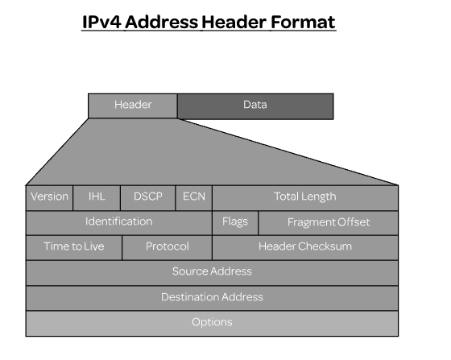
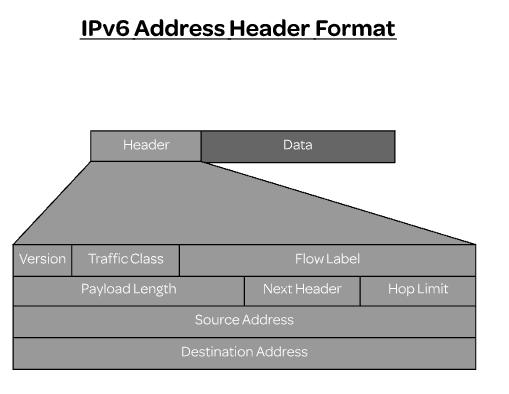

## Sumário
* [Network Addressing](#network-addressing)

---

## Network Addressing
### IPv4 and IPv6

* **IP**: connectionless protocol that allows computers on a network to communicate with each other.
  * The communication is accomplished in a few different ways:
    * First, IP specifies the format for the data unit or the packet that it's going to transmit between hosts;
    * Then next, it's going to provide addressing for the host on the network in order to identify and locate them;
    * Then, lastly, it's going to provide mechanisms for routing the packets between these different hosts.

* Each of these packets are going to contain source and address information so they could be accurately routed between the machines on the network.

* **IPv4**: 32-bit address (4 sections of 8 bits, decimal).
  * 192.168.101.101;
  * Given that it became a real possibility that the number of IP addresses would be exhausted, this is one of the major motivations behind the development of IPv6.

* **IPv6**: 128-bit address (8sections of 1 bits, hexadecimal).
  * 2001:0db8:0a0b:12f0:0000:0000:0000:0001;
  * Provides a much larger networks;
  * Implements a more simplified packet header (helps routers process packets more quickly and efficiently);
  * Provides enhancements to security,

* **Zero suppression and zero compression**:
  * 2001:0db8:0a0b:12f0:0000:0000:0000:0001 => 2001:db8:a0b:12f0::1.

* **IPv4 mapped IPv6 addresses**: an IPv4 address that's going to be embedded into an IPv6 address; used to represent IPv4 addresses as IPv6 addresses to IPv6 enabled applications.
  * ::FFFF:192.168.0.21;
  * First 8 bits set to 0, the next 16 bits set to 1, and the last 32 bits cotain the actual IPv4 address.

---

* **Version**: the IP protocol version, which for IPv4 is going to be four.
* **Internet Header Length (IHL)**: the length of the entire IP header. 
* **Differentiated Services Code Point (DSCP)**: classify the different type of network traffic and also provide some quality of service. 
* **Explicit Congestion Notification (ECN)**: carry information about observed network congestion. 
* **Total length**: the length of the entire IP packet in bytes. 
* **Identification**: unique identifier that's going to be supplied to packets that have been further fragmented. 
* **Flags**: used to enable and control fragmenting
* **Fragment offset**: used to offset a particular fragment relative to the beginning of the original data packet. 
* **Time to Live (TTL)**: limits the number of routers that a packet passes through (prevent endless loop). 
* **Protocol**: the protocol used in the data portion of the packet, which is going to be something like TCP or UDP. 
* **Header checksum**: store the checksum value of the header; used to check for errors after the packet's arrival. 
* **Source address**: the IP address of the sender.
* **Destination addresses**: the IP address of the receiver. 
* **Options**: contain additional options for the packet (such as setting the timestamp); in order to use this field, the value of the IHL must be greater than five.

* **Version**: the IP protocol version, which for IPv4 is going to be four.
* **Traffic Class**: first six bits used to classify the packets (help ensure the quality of service) and the last two bits are used for explicit congestion control (ECN).
* **Flow Label**: indicates which packets belonged to which communication (helps with packets sequencing by preventing packets from being reordered). 
* **Payload Length**: specifies the size of the data payload.
* **Next Header**: the type of extension header (TCP or UDP); if an extension header is not used, then indicates the type of data that's being sent.
* **Hop Limit**: limits the number of routers that a packet passes through (prevent endless loop).
* **Source address**: the IP address of the sender.
* **Destination addresses**: the IP address of the receiver.

---

* **Reserved IP addresses**:
  * **Private**: can't be routed to internet; used in LAN.
    * **IPv4**:
      * 10.0.0.0 - 10.255.255.255;
      * 172.16.0.0 - 172.31.255.255;
      * 192.168.0.0 - 192.168.255.255.
    * **IPv6**:
      * fd00::/8.
  * **Loopback**: reserved for localhost; managed my the OS.
    * **IPv4**: 127.0.0.0 - 127.255.255.255;
    * **IPv6**: ::1/128.
  * **Link-local**: used in the absence of DHCP or static addresses; can only communicate within its own network segment; routers will not foward packets from a loopback; uses ARP.
    * **IPv4**: 169.254.0.0 - 169.254.255.255;
    * **IPv6**: fe80::/10.