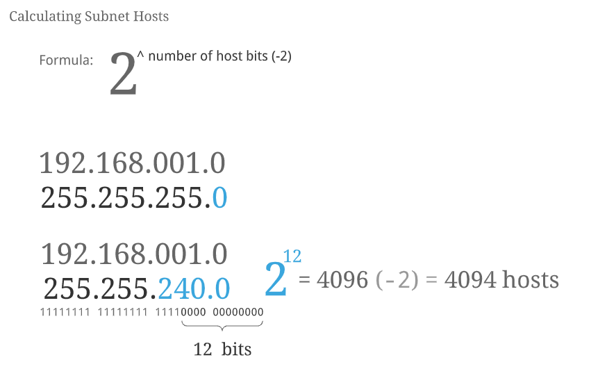
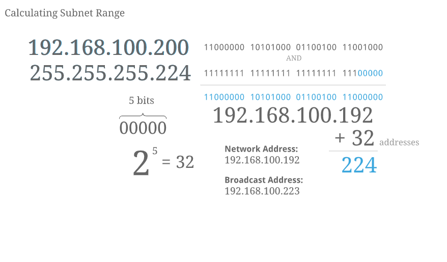
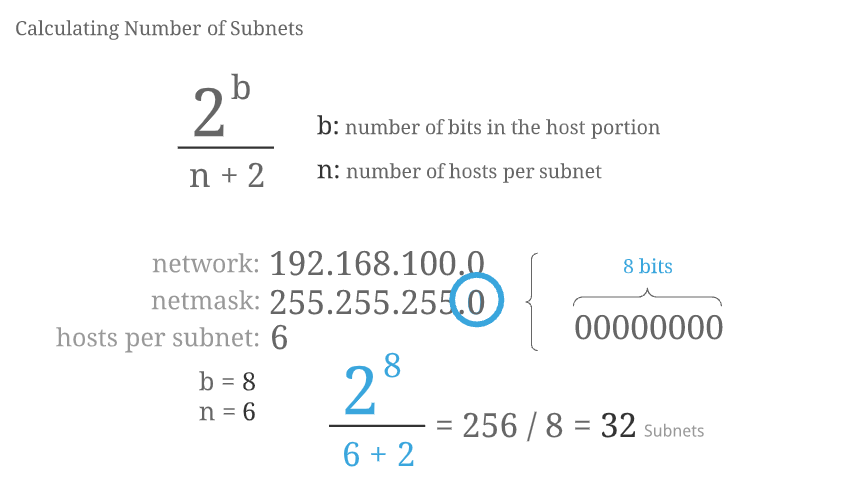
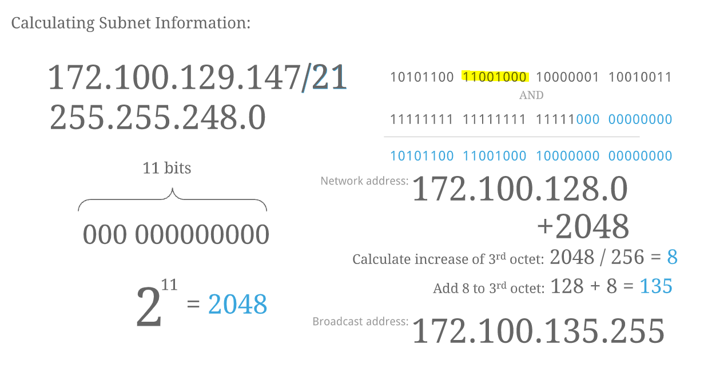
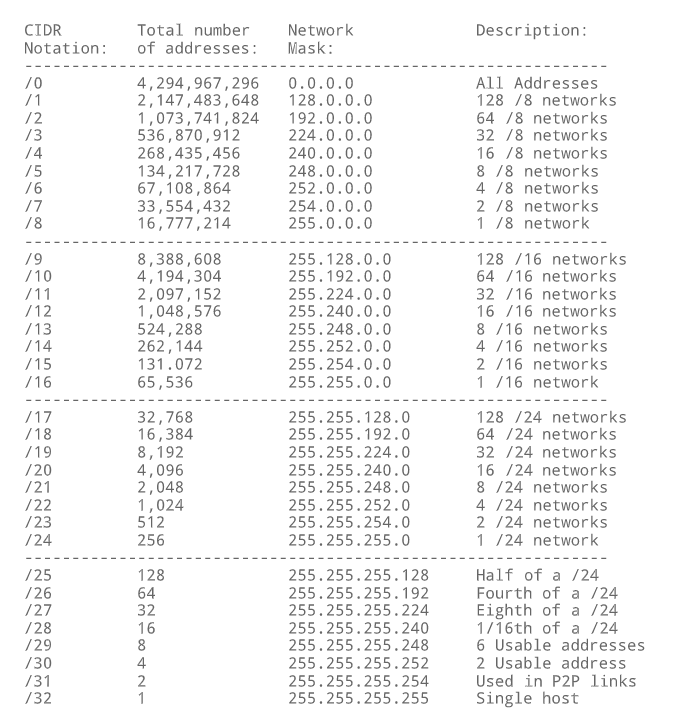

## Sumário
* [Network Address Translation (NAT)](#network-address-translation-nat)
* [Subnetting Calcs](#subnetting-calcs)

---

- **Network Address Translation (NAT)** is the process of mapping or translating one IP address to a different IP address (or addresses) by modifying the network address information in the IP header of network packets. This method is used to map a single public (routable) IP address to one or more private (unroutable) IP addresses. This helps prevent the exhaustion of public IPv4 addresses.

  - **Static NAT**
    - The NA device is ass' gned a pool Of public IP addresses;
    - Private IP addresses are mapped to the public IP addresses;
    - Used in situations that require servers to always be mapped to the same public IP address.

  - **Dynamic NAT**
    - The NA device is ass' gned a pool Of public IP addresses;
    - Public IP addresses are used when they are needed by a hostand then returned to the pool once they are no longer in use;
    - Used in situations in which the public IP address does not need to be consistently mapped to the same private IP address.

  - **Port Address Translation**
    - Asingle public IP is assigned to a network;
    - All thedevices on the network share the single IP address;
    - The NA device records the private IP address as well as the port—also called the source port address — used by the internal host to ensure that communication is sent back correctly;
    - This is the most common type Of NA;
    - Helps conserve the number Of available IP address.

---

## Subnetting Calcs

- **Calculate the number of hosts**

- **Calculate the subnet range**

- **Calculate the number of hosts per subnet**

- **Calculate subnet information of the subnet by CIDR**

- **Table of CIDR masks**

